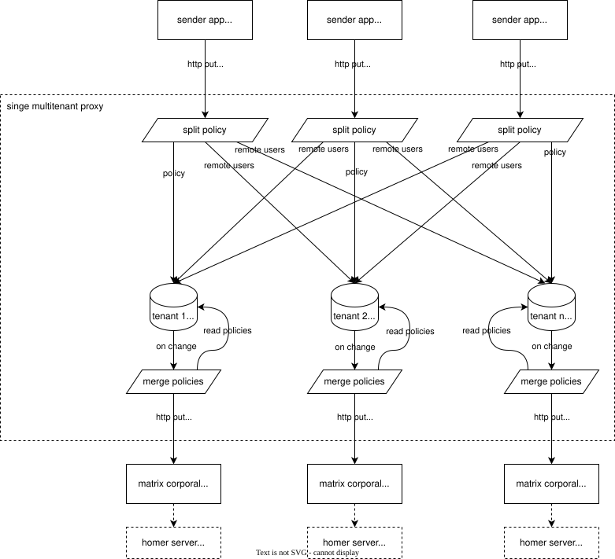

# matrix corporal multitenant proxy

## Configuration
Configuration can be set as env variable `MCMTP_CONFIG` or in a config file. The config will be read by default from `./config.json`. The config path can be set via cli arg `--config ` or env variable `MCMTP_CONFIG_PATH`.

The config is a json object with the following properties. Only `reconcileRetryInterval` is optional. It default values is 30s.
```json
{
    "listenAddress": "[::]:3000",
    "storagePath": "/var/lib/mcmtp",
    "reconcileRetryInterval": 30,
    "instances": [
        {
            "homeServerName": "a.test",
            "apiAccessToken": "a-secure-token-for-the-app-to-push-multi-tenant-policies",
            "corporalApiUrl": "http://coporal:3000",
            "corporalAccessToken": "a-secure-token-to-push-policies-to-corporal"
        }
    ]
}
```

## Multitenant Policy
A multitenant policy is a matrix corporal policy with one additional key. The `remoteUsers` key contains a list, of user which room member ship should be managed, but do not belong to originating tenants 

## How its works
1. App sends a multitenant policy to matrix corporal multitenant proxy (mcmtp).
2. Mcmtp splits the multitenant config into a normal policy and multiple exchange policyies. An exchange policy contains the all users from `remoteUsers` from one specific instance
3. The policy and all exchangePolicies for users of a tenant, get stored in a tenant specific store. (This store also persists policies over restarts.)
4. When a store is update, the base policy and all exchangePolicies are merged into a single policy. See [Merging beauvoir](#merging-beauvoir)
5. The resulting policy is pushed to that tenants matrix corporal.
6. Matrix corporal applies the policy



### Merging beauvoir
* Merging a remote user, only merges their joinedRooms.
* If a joined room already exists in the policy, the highest power level is used.
* Remote users only get merged, if they already exist in the policy. Otherwise they get ignored.
* Managed rooms get added automatically.
